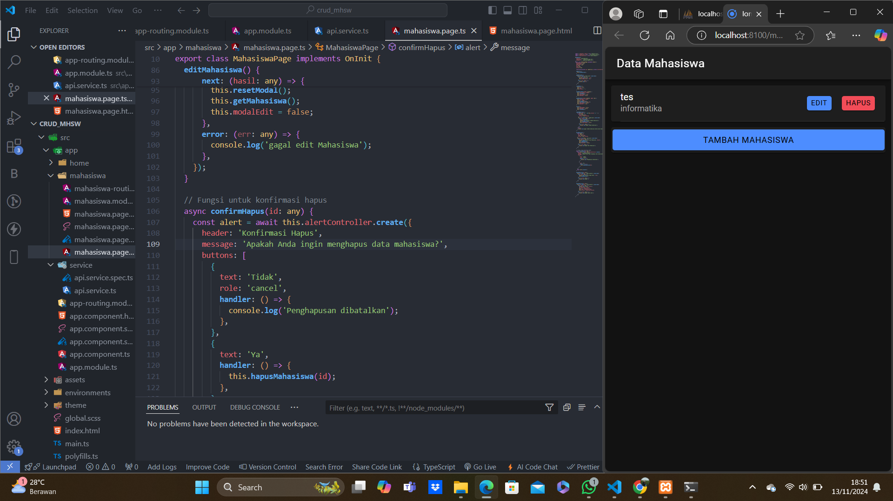
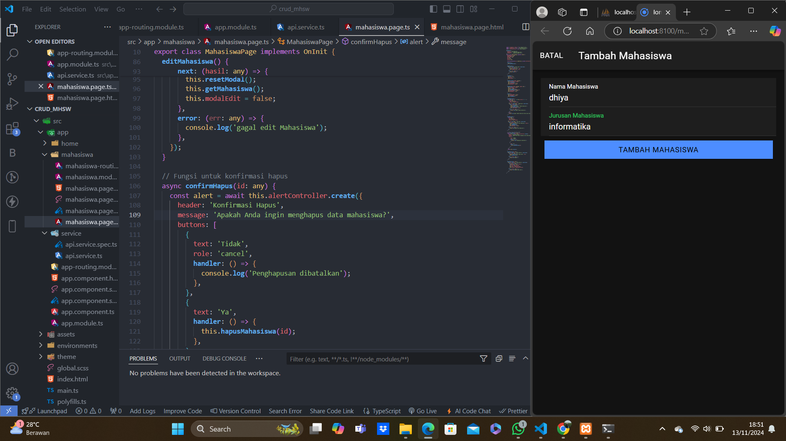

*Nama   = Dhiya Ulhaq Ayyuasy*

*NIM    = H1D021040*

=======Tugas Praktikum CRUD Mahasiswa=======

Penjelasan CRUD dari Data Mahasiswa

1. Read 
Fungsi getMahasiswa()
a. Fungsi ini dipanggil pada ngOnInit(), yang berarti akan langsung dieksekusi saat komponen MahasiswaPage dimuat.
b. Fungsi ini menggunakan metode tampil dari ApiService dengan endpoint tampil.php.
c. Ketika subscribe dijalankan:
    Jika request berhasil (next), data mahasiswa yang diterima dari server akan disimpan dalam variabel dataMahasiswa.
    Jika ada error (error), error akan ditampilkan di konsol.
    Data yang ada di dataMahasiswa kemudian ditampilkan dalam halaman 

2. Create
Fungsi tambahMahasiswa()
a. Fungsi ini dipanggil ketika tombol "Tambah Mahasiswa" ditekan dalam model tambah
b. Fungsi ini akan memeriksa apakah inputan nama dan jurusan sudah terisi. Jika ada yang kosong maka tidak dapat menyimpan data dan halaman tidak akan berpindah
c. Jika semua input terisi, fungsi membuat objek data berisi nilai nama dan jurusan 
d. Fungsi kemuadian memanggil metode tambah dari ApiService dengan data tersebut dan mengirimkannya ke endpoint tambah.php
e. Saat subscribe dipanggil, jika request berhasil maka data akan ditampilkan 

3. Update
Fungsi openModalEdit()
a. Fungsi ini dipanggil ketika tombol "Edit" pada data mahasiswa ditekan.
b. Fungsi menerima id mahasiswa yang ingin diedit dan memanggil fungsi ambilMahasiswa() untuk mengambil data mahasiswa berdasarkan id.
c. Modal edit kemudian ditampilkan dengan mengatur modalEdit menjadi true.

Fungsi editMahasiswa()
a. Fungsi ini dipanggil ketika tombol "Edit Mahasiswa" pada modal edit ditekan.
b. Fungsi ini membuat objek data berisi id, nama, dan jurusan dari mahasiswa yang ingin diperbarui.
c, Fungsi kemudian memanggil metode edit dari ApiService untuk mengirim data ke endpoint edit.php.
d. Saat subscribe dijalankan, Jika berhasil (next), modal ditutup, data mahasiswa di-refresh dengan memanggil getMahasiswa(), dan pesan berhasil tampil di konsol.

4. Delete
Fungsi confirmHapus()
a. Fungsi ini dipanggil ketika tombol "Hapus" pada data mahasiswa ditekan.
b. Fungsi ini menampilkan AlertController untuk konfirmasi hapus, dengan pesan "Apakah data ingin dihapus?" dan dua opsi: "Ya" dan "Tidak".
c. Jika "Tidak" dipilih, maka tidak ada tindakan diambil, dan proses berhenti.
d. Jika "Ya" dipilih, maka fungsi hapusMahasiswa(id) dipanggil untuk melakukan penghapusan data.

Fungsi hapusMahasiswa()
a. Fungsi ini dipanggil setelah konfirmasi hapus dan menerima parameter id mahasiswa yang ingin dihapus.
b. Fungsi ini memanggil metode hapus dari ApiService dengan endpoint hapus.php?id=.
c. Saat subscribe dijalankan: Jika request berhasil (next), data mahasiswa di-refresh dengan memanggil getMahasiswa(), dan pesan berhasil tampil di konsol.

